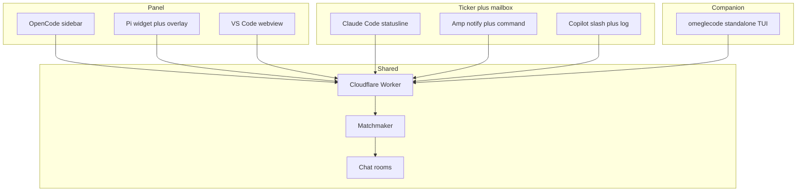

# Omeglecode on other coding agents

Research and product recommendation. Not an implementation spec. Decide the UX contracts here, then build.

## What we are actually porting

Omeglecode is not "chat for developers." Slack already exists. The product is a **hallway inside the coding surface**:

- You are already in a session. A small group of other people who are also in a session appear beside you.
- No accounts. Nickname only. The service never sees prompts, code, paths, or raw session IDs.
- Presence is ambient. You can ignore it. When you want to talk, you type in place and hit Enter.
- Rooms are small (8) and sticky for six hours, or named by invite code.
- The agent is not in the room. Humans talk to humans. The LLM does not send, receive, or summarize chat.

That last point is the design constraint that kills most plugin systems. In 2026 almost every coding-agent "plugin" is **agent-facing**: skills, MCP tools, hooks, subagents, prompt commands. Those extend what the model can do. Omeglecode needs to extend what the **human** can see and type **without going through the model**.

If chat is routed through the LLM, the product becomes worse: delayed, billed, mixed into context, and no longer anonymous. Do not ship Omeglecode as a skill, MCP tool, or "ask the agent to send a message."

## The industry split

Two plugin families exist. They look similar in marketing and are not interchangeable.

| Family | What it actually is | Examples | Can it host Omeglecode? |
| --- | --- | --- | --- |
| **User-facing UI** | In-process UI: slots, widgets, overlays, real slash handlers, keymaps | OpenCode v2 TUI plugins, Pi extensions, Amp commands/dialogs, Copilot CLI extensions, VS Code webviews | Yes, at some fidelity |
| **Agent-facing bundles** | Skills + MCP + hooks + markdown slash commands packaged for the model | Claude Code plugins, Codex plugins, Cursor Plugins / Agent Plugins, Devin plugins, Factory Droid plugins, Crush skills, Goose MCP, Antigravity plugins | Only as a status ticker or a companion process. Not as a panel |

The open [Agent Plugins](https://agent-plugins.org) spec (Cursor, Codex, Copilot, Kiro, VS Code, and others) is explicitly skills + `mcp.json`. It has no UI surface. Cursor "plugins," Devin "plugins," and Claude Code "plugins" are this family. They are the wrong layer for a hallway.

## How close each host can get

Fidelity is scored against the OpenCode experience, not against "is there some way to send a message."

| Host | Plugin surface | Persistent panel | Live presence | Type-in-place | Real slash / keymap | Session-sticky rooms | Honest ceiling |
| --- | --- | --- | --- | --- | --- | --- | --- |
| **OpenCode v2** | TUI slots, commands, dialogs, storage | Sidebar | Yes | Yes | Yes | Hash of session ID | **100%** — already ships |
| **Pi** | TypeScript extensions, `setWidget`, `ui.custom` overlay, commands, shortcuts | Widget above/below editor, not a right sidebar | Yes | Overlay or widget input | Yes | Hash of session file path | **~85%** — closest native port |
| **VS Code family** (Cursor IDE, Copilot Chat, Continue, Cline, Windsurf, Zed-via-extension) | VS Code Extension API, webview sidebar | Real sidebar | Yes | Yes | Commands | Hash of workspace + window, or invite-only | **~80%** — high reach, different aesthetic |
| **Amp** | Pi-inspired plugins: commands, dialogs, `session.start`, `notify` | No widgets | Toasts only | Compose dialog | Command palette | Hash of thread ID | **~40%** — pager, not panel |
| **Copilot CLI** | Node extensions: real slash handlers, `session.log`, dialogs; canvases are browser tabs | No live TUI panel ([issue](https://github.com/github/copilot-cli/issues/3979)) | Log lines / toasts | Slash send | Yes | Hash of session ID | **~35%** — mailbox in the timeline |
| **Claude Code** | Plugins = skills, markdown commands, hooks, MCP; `statusLine` is a shell script | No | Status line snippet | No (unless `!bash` or agent-run script) | Prompt-commands, not UI handlers | Hash of session UUID from hook JSON | **~25%** — ticker + mailbox |
| **Antigravity (`agy`)** | Plugins (ex-Gemini extensions), skills, MCP, custom `statusLine` | No | Status line | No | Prompt-commands | Session from statusline JSON | **~25%** — same shape as Claude Code |
| **Goose Desktop** | MCP + [MCP Apps](https://blog.modelcontextprotocol.io/posts/2026-01-26-mcp-apps/) iframes | In-chat iframe, not ambient | Only after a tool call | Inside iframe | No | Weak | **~30%** — wrong trigger (agent must open it) |
| **Codex CLI** | Agent Plugins: skills, MCP, app connectors; built-in status line items only | No | No custom ticker | No | Prompt-commands | Weak | **~15%** — companion TUI or skip |
| **Devin** | Closed-beta plugins: skills, rules, hooks, MCP, subagents. No third-party UI | No | No | No | No | Cloud session, not ours | **~10%** — skip, or companion TUI beside Desktop |
| **Factory Droid** | Claude-compatible plugins; markdown `/commands` | No | No | No | Prompt-commands | Weak | **~15%** — same as Claude Code mailbox |
| **Crush** | Skills + MCP. Charm TUI, no extension widgets | No | No | No | User-invocable skills (still model) | Weak | **~10%** — companion TUI |
| **Goose CLI, Aider, Warp agent pane** | MCP / none | No | No | No | No | Weak | **~10%** — companion TUI in a split |

Pi is the only other **terminal agent** that can host a living chat view inside its own chrome. Everyone else is a ticker, a mailbox, a browser tab, or a second process.

## Three UX contracts, not one UI

Do not clone the OpenCode sidebar onto hosts that cannot draw one. Ship three honest contracts that share the Worker and invite codes.

### Panel

For hosts that can paint and take focus.

- Always-on connection while the session is open, even if the chat is collapsed.
- Room label, online count, last ~50 messages, inline input.
- `/omegle-nickname`, `/omegle-connect CODE`, `/omegle-invite`.
- A shortcut that focuses chat and Esc that returns to the agent.

**OpenCode:** keep the sidebar. It is the reference.

**Pi:** this is the port worth doing. Full UX contract and mock: [`specs/pi-omeglecode.md`](pi-omeglecode.md).

Follow [pi-live-terminal](https://github.com/tanishqkancharla/pi-live-terminal), not a fake sidebar. Pi's native slot is a live pane **above the prompt** (`setWidget(..., { placement: "aboveEditor" })`).

1. **Expanded (default):** boxed hallway above the editor — header, ~8 messages, shortcut footer. The Pi prompt stays focused. Transcript shrinks; nothing is covered.
2. **Compact:** one title line above the prompt. `ctrl+shift+c` toggles. Socket stays up.
3. **Focus:** `ctrl+shift+m` opens a bottom overlay with an input, same as live-terminal's focus modal, but not full-screen. Esc returns to Pi.
4. **Session stickiness:** hash `"pi:" + session file path`.

A right overlay covers the transcript and ignores the slot Pi already gives us.

### Ticker + mailbox

For hosts that can show a sliver of state and run a real command, but cannot host a panel.

Rules:

- Presence lives in the one line the host already owns (status line, toast, footer).
- Sending is a command or dialog, never a prompt to the model.
- Reading recent history is a command that prints *to the user*, not into the thread.
- Incoming messages may toast. They must not inject into the LLM context.

**Claude Code / Antigravity:** a plugin that is honest about the ceiling.

- `SessionStart` hook opens the WebSocket (session UUID is in the hook JSON).
- `statusLine` (or a segment if the user already has `ccstatusline`) shows `omegle 4 · last: maya "anyone on bun?"`.
- `/omegle-send`, `/omegle-connect`, `/omegle-invite` must **not** be markdown prompt files. Ship a small `omegle` CLI and document `!omegle send …` plus plugin scripts the statusline already runs. If we only ship prompt-commands, Claude will try to "help" and the hallway dies.
- Never add a `UserPromptSubmit` hook that stuffs chat into the prompt.

**Amp:** connect on `session.start`. `ctx.ui.notify` on new messages. `registerCommand` opens `ctx.ui.input` to send and `ctx.ui.select` to pick a recent line to copy. Do **not** `thread.append` chat into the Amp thread.

**Copilot CLI:** same mailbox. Real slash handlers exist, which is the whole reason to bother. `session.log` for incoming lines. No live panel until they ship one.

### Companion

For everyone else, including Devin, Codex, Crush, Goose CLI, and Warp.

A standalone `omeglecode` TUI (or a one-command `npx omeglecode`) that speaks the existing protocol. User splits the terminal: agent on the left, hallway on the right. Invite codes still work with Panel and Ticker users.

This is not a consolation prize. It is the only way Devin Desktop, Codex, and Crush users join the same rooms, and it is the fallback when a host ships a plugin API next year that still has no UI.

Cursor IDE is the awkward case: **Cursor Plugins cannot draw a hallway**, but a **VS Code extension can**. Those are different products. A Cursor Marketplace plugin would at best install an MCP server the agent could call, which we should refuse. A VS Code sidebar extension is a Panel host with huge reach and a mouse-first look. Treat it as a later, separate decision, not as "the Cursor plugin."

MCP Apps / Cursor canvases / Goose in-chat iframes are also the wrong trigger. They appear when the **agent** decides to render a tool UI. Omeglecode has to be on before anyone talks.

## Cross-agent rooms are the actual expansion

The Worker already accepts any client that hashes a session and optionally sends a room code. OpenCode users and Pi users in `/omegle-connect weekend-test` are already in the same Durable Object the moment both clients exist.

Two matchmaking policies:

| Policy | Random rooms | Invite rooms |
| --- | --- | --- |
| **Mix all agents** (recommended) | Anyone online, any host, shuffled into groups of 8 | Anyone with the code |
| **Partition by host** | OpenCode with OpenCode, Pi with Pi | Anyone with the code |

Mixing is the Omegle thesis: strangers who happen to be coding. "I'm in Pi, you're in OpenCode" is a better story than a per-tool ghetto. Invite codes stay the way friends find each other. Partitioning would shrink every room for no privacy gain — we still never send code or prompts.

Session hashes stay per-host-session so `/new` still moves you. Prefix the hashed material with a host tag (`opencode:`, `pi:`) so IDs cannot collide across products, then let the matchmaker ignore the prefix when ranking rooms.

## What not to build

- **MCP tools that send or read chat.** Pollutes context, leaks the hallway into the model, and is not realtime.
- **Claude / Codex / Cursor / Devin / Factory "plugins" that are only SKILL.md files.** They teach the agent to talk about Omeglecode. They do not run Omeglecode.
- **Fake sidebars** on hosts without slots: dumping a transcript above the Pi editor, or printing history on every Claude turn.
- **Devin-native UI.** Closed beta, no third-party chrome, cloud sessions we do not control.
- **Codex statusline hacks.** The footer is a fixed enum. There is nothing to hook.
- **Goose MCP Apps as the desktop strategy.** Fine as a later experiment; bad as the first impression because it is tool-gated.

## Suggested build order

Do the architecture slice once, then one host per fidelity so we learn the UX before cloning it.

### 0. Extract a host-agnostic client

Pull `packages/plugin/src/Chat.ts` (connect, hash, reconnect, send, presence) into something like `packages/client` that any host can import. Keep OpenCode's Solid/OpenTUI panel as the first consumer. No behavior change.

This is the whole game: one protocol, many shells.

### 1. Pi extension — first new host

Highest fidelity after OpenCode. Same audience (indie TUI agents). Real widgets, real commands, session files for stickiness, overlay for the full chat.

Ship:

- `npx omeglecode install pi` (or a `~/.pi/agent/extensions/omeglecode.ts` drop-in).
- Collapsed widget + overlay chat, Pi-shaped, not an OpenCode clone.
- Same Worker, same invite codes. Mixed random rooms.

If this feels good, we have proof the product survives without a right sidebar. If it feels cramped, we learn that before touching Claude.

### 2. Standalone companion TUI

Unblocks Devin, Codex, Crush, Goose, Warp, and anyone who will not give us chrome. Also the development harness for Ticker hosts: the statusline can call the same binary.

This is the "we exist everywhere" move. Panel and Ticker become nicer ways to sit in the same rooms.

### 3. Claude Code as ticker, only if 1–2 work

Volume play. Honest UX: statusline presence, CLI mailbox, no pretend sidebar. Antigravity and Factory can reuse most of this because they copied Claude's plugin shape.

Skip if we cannot send without the model in the loop. A prompt-command that says "run omegle send" is a footgun.

### Later, maybe

- **Amp pager** — cheap once the client exists; toasts + command. Wait if they add `setWidget` (the API is already Pi-shaped).
- **Copilot CLI mailbox** — real slash handlers, still no panel.
- **VS Code / Cursor IDE sidebar** — different product (GUI, marketplace review, mouse). Worth it for reach, not for fidelity to the original joke. Do not confuse with a Cursor Plugin.

## Product recommendation

Build **Pi as a Panel host** and a **standalone companion TUI**, on top of a shared client. Treat Claude/Amp/Copilot as tickers only after those two feel like Omeglecode. Do not spend a cycle on Devin, Codex, Crush, or Cursor Marketplace plugins.

The UX to go for:

1. **Same hallway, host-native chrome.** Pi gets a one-line widget and an overlay, not a fake sidebar.
2. **Invite codes are the cross-agent join spell.** Copy `/omegle-connect weekend-test` from OpenCode into Pi or into the companion.
3. **Random rooms mix hosts.** The interesting part of expanding is meeting someone who is not in your tool.
4. **The agent never enters the room.**

Once that is agreed, implementation starts with the client extract and the Pi overlay.
