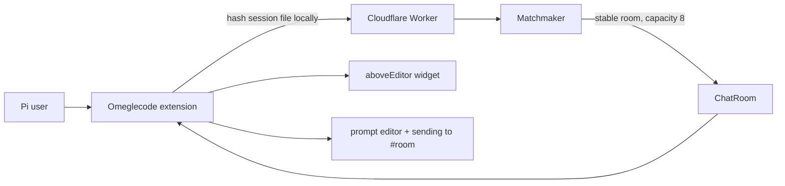
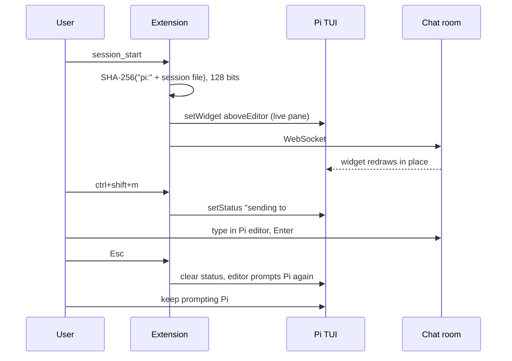

# Pi Omeglecode

Best-possible recreation of the OpenCode hallway inside Pi. Interactive mock: [`prototypes/pi-omeglecode.html`](../prototypes/pi-omeglecode.html).

Steal the chrome from [pi-live-terminal](https://github.com/tanishqkancharla/pi-live-terminal), not from OpenCode's sidebar. That extension already proved the native slot: a bordered live pane **above the prompt**, `setWidget(..., { placement: "aboveEditor" })`. The Pi transcript shrinks. Nothing covers it. You keep typing to the agent while the pane updates.

Omeglecode is the same object with chat inside it.

## System flow





## What it looks like

Pi is vertical: transcript, **widget**, editor, footer. The hallway lives in the widget, the same place live-terminal puts tmux.

### Expanded — default

A boxed pane directly above the prompt. ~8 history rows and a header. Connection is already live. The Pi editor stays focused.

```
you
  the auth middleware is rejecting valid JWTs after refresh

pi
  I'll inspect the token refresh path next.

  [read] src/auth/middleware.ts

╭─ omegle  ·  4 online  ·  random ──────────────────────────────╮
│ maya  12:05                                                   │
│ anyone using bun for this?                                    │
│ nova  12:06                                                   │
│ yeah, 1.2 is fine                                             │
╰───────────────────────────────────────────────────────────────╯
▌ also bump the tests_
~/acme  opus 4.6  18.2k  $0.04
```

This is the OpenCode sidebar, laid down. Same header (`omegle`, count, room). Same transcript. No input row — that is what live-terminal does too. Invite is `/omegle-invite`, not a fake button in the title.

Rules:

- Box-drawing borders via `theme.fg("border", ...)`, title in accent, hints in muted/dim. Truncate every line to `width`.
- History sticks to the bottom. Mouse wheel scrolls, same as live-terminal's widget `handleInput`.
- New messages restyle the count for ~1.2s. Do not toast every line.
- Height: 8 body rows, or `min(8, max(3, floor(terminalRows * 0.28)))`. Live-terminal uses 16 because a tty needs a screen. Chat does not.
- No nickname yet: body is `run /omegle-nickname to join`.

### Compact

`ctrl+shift+c` or `/omegle-toggle` collapses to one title line above the prompt. Socket stays up.

```
╭ omegle  ·  4 online  ·  random  ·  maya: anyone using bun? ───╮
▌ also bump the tests_
```

Toggle again to expand. Hidden entirely is a third press, or `/omegle-toggle` cycling `expanded → compact → hidden → expanded`. Prefer compact over hidden so presence never disappears.

### Send — type in the Pi prompt

Widgets do not own the keyboard. **`ctrl+shift+m`** (keep OpenCode's chord) puts the existing Pi editor into send mode. The footer status reads `sending to #weekend-test` or `sending to random`. Enter sends to the room. Esc returns to prompting Pi. Slash commands still run.

Do not open a `ctx.ui.custom` overlay to type. Do not add a compose row to the widget. The hallway is read-only chrome; the prompt is the input.

```
╭─ omegle  ·  4 online  ·  #weekend-test ───────────────────────╮
│ maya  12:05                                                   │
│ anyone using bun for this?                                    │
│ kai  12:06                                                    │
│ yeah, 1.2 is fine                                             │
╰───────────────────────────────────────────────────────────────╯
▌ yeah, 1.2 is fine_
~/acme  opus 4.6  18.2k  $0.04  sending to #weekend-test
```

`pi.on("input")` returns `{ action: "handled" }` so the model never sees the line. Empty Enter is also handled. Esc is intercepted on the editor wrapper so it does not abort the agent, and invite overlays still close.

### Invite

`/omegle-invite` uses a small centered `ctx.ui.custom` dialog. Random rooms mint a code, reconnect, then show:

```
Invite to Omegle

Room: weekend-test

Ask them to run:
/omegle-connect weekend-test

Works in OpenCode, Pi, or the companion TUI.
```

The widget title switches from `random` to `#weekend-test`.

## Why this is the ceiling

| OpenCode | Pi, following live-terminal | Gap |
| --- | --- | --- |
| Dedicated sidebar column | `aboveEditor` widget. Real layout. Transcript shrinks, nothing is covered | Vertical instead of right |
| Sidebar always visible while you prompt | Widget has no keyboard; editor stays focused | Same feeling |
| Inline input in the sidebar | Same Pi editor, footer `sending to #room` | Extra chord to type; Esc still returns |
| Sidebar toggle | Compact/hide the widget | Same |
| Always-on socket | Connect on `session_start`, independent of widget height | Same |
| Session-sticky rooms | Hash `"pi:" + ctx.sessionManager.getSessionFile()` | Same |

A right-edge overlay was the previous proposal. Drop it. It covers the transcript, fights Pi's vertical layout, and ignores the slot this repo's author already uses for live panes.

Do not grow the widget to 16+ rows. That is a terminal. This is a hallway. Do not `sendMessage` / `appendEntry` chat into the Pi thread. Do not register an LLM tool that sends chat.

## Chrome and chords

OpenCode names, live-terminal shape.

| Action | Chord / command | live-terminal analog |
| --- | --- | --- |
| Send via Pi editor | `ctrl+shift+m` | `ctrl+shift+f` |
| Compact / expand widget | `ctrl+shift+c` or `/omegle-toggle` | `ctrl+shift+v` detach |
| Nickname | `/omegle-nickname` | — |
| Join named room | `/omegle-connect CODE` | `/live-terminal:attach` |
| Invite / mint code | `/omegle-invite` | — |
| Send | Enter (while sending) | — |
| Return to Pi | Esc | close focus modal |

## Session, privacy, matchmaking

On `session_start`:

1. Read nickname + last room from `~/.pi/agent/omeglecode.json`.
2. Session key = SHA-256 of `pi:` plus the session file path, truncated to 32 hex chars. Ephemeral sessions hash `pi:ephemeral:` plus cwd plus process start time.
3. Connect to the existing Worker. Same protocol, 8-person cap, 50-line history, 280-char messages.
4. `setWidget("omeglecode", factory, { placement: "aboveEditor" })`.

On `session_shutdown`: `setWidget("omeglecode", undefined)`, close the socket.

Prefixing `pi:` avoids colliding with OpenCode session IDs. Random rooms still mix hosts.

## Pi API mapping

Copy the live-terminal attach pattern.

```ts
pi.on("session_start", (_event, ctx) => {
  if (!ctx.hasUI) return;
  connectSocket(sessionKey(ctx));
  ctx.ui.setWidget(
    "omeglecode",
    (tui, theme) => new OmegleWidget(tui, theme, store),
    { placement: "aboveEditor" },
  );
});

pi.registerShortcut("ctrl+shift+m", {
  handler: (ctx) => toggleSendMode(ctx),
});

pi.registerShortcut("ctrl+shift+c", { handler: cycleDensity });
pi.registerCommand("omegle-toggle", { handler: cycleDensity });
pi.registerCommand("omegle-nickname", { handler: promptNickname });
pi.registerCommand("omegle-connect", { handler: connectRoom, getArgumentCompletions });
pi.registerCommand("omegle-invite", { handler: invite });
```

`OmegleWidget.render(width)` returns a `string[]` of boxed lines, same structure as `LiveTerminalWidget`. Incoming events call `tui.requestRender()`. Theme only through `theme.fg(...)`.

Install: `npx omeglecode install pi` writes `~/.pi/agent/extensions/omeglecode/index.ts` (jiti). Or `pi install` once the package is an extension.

## Goals

- Recreate the hallway in Pi's native live-pane slot.
- Keep the socket up while the widget is compact or hidden.
- Preserve OpenCode slash names and `ctrl+shift+m`.
- Mix with OpenCode users in random and invite rooms.

## Non-goals

- A right sidebar clone.
- Full-screen focus (live-terminal needs that for a tty; chat does not).
- Agent-mediated send/receive.
- Replacing Pi's footer.

## Implementation

### Phase 1: Shared client

Extract connect, hash, reconnect, send, subscribe from `packages/plugin/src/Chat.ts`. Pi hashes `"pi:" + session file`; OpenCode keeps hashing the raw session ID.

### Phase 2: Pi extension

- [x] `session_start` / `session_shutdown`.
- [x] `OmegleWidget` above the editor, expanded + compact.
- [x] Send mode uses the Pi editor; footer says `sending to #room`; Esc returns.
- [x] Shortcuts and slash commands.
- [x] Nickname + room in `~/.pi/agent/omeglecode.json`.
- [x] Invite dialog.
- [x] Installer target `pi`.

### Phase 3: Feel

- [ ] Editor keeps keys while the widget is visible.
- [ ] Send mode: Enter sends to the room, Esc returns, history sticks to bottom.
- [ ] `/reload` reconnects instead of leaking sockets.
- [ ] Sit next to pi-live-terminal: two `aboveEditor` widgets stack. Keep Omegle compact by default if a live terminal is already using height — if we cannot detect that, 8 rows is the cap.
