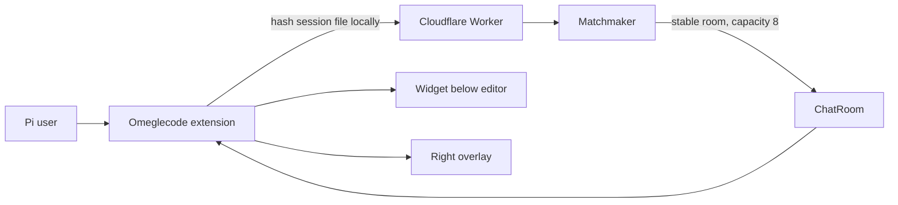
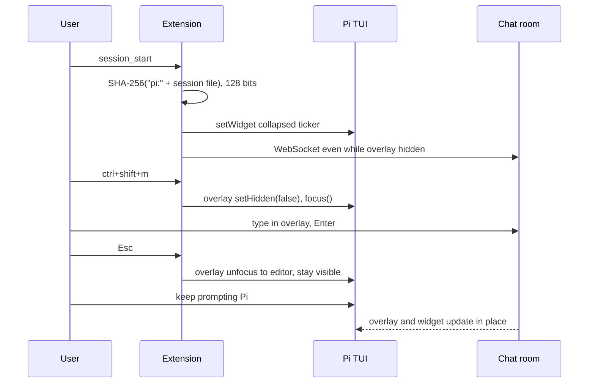

# Pi Omeglecode

Best-possible recreation of the OpenCode hallway inside Pi. Implementation spec plus UX contract. The interactive mock lives at [`prototypes/pi-omeglecode.html`](../prototypes/pi-omeglecode.html).

Pi has no right sidebar slot. It does have a persistent widget under the editor, a session-lived overlay that can stay on screen while the editor has focus, and real slash commands. That is enough to keep the feeling: ambient presence, one keystroke into a small room, Esc back to the agent, the model never in the chat.

## System flow





## What it looks like

Pi is a vertical TUI: transcript, editor, footer. Omeglecode occupies two surfaces so the transcript does not get a fake 14-line chat dumped into it.

### Collapsed — default

One widget line **below the editor**, `placement: "belowEditor"`. Connection is already live.

```
you
  the auth middleware is rejecting valid JWTs after refresh

pi
  I'll inspect the token refresh path next.

  [read] src/auth/middleware.ts

▌ also bump the tests_

omegle  ·  4 online  ·  random  ·  maya: anyone using bun?     ctrl+shift+m
~/acme  opus 4.6  18.2k  $0.04
```

Rules for this line:

- Left: `omegle` in the theme accent, then count, then room (`random` or `#weekend-test`).
- Middle: last message preview, truncated. Empty rooms show the status string (`connecting`, `choose a nickname`).
- Right: the focus chord, matching OpenCode's `ctrl+shift+m` hint.
- New messages restyle the count for ~1.2s (`theme.fg("accent")`), then return to muted. Do not toast every line.
- No nickname yet: `omegle  ·  /omegle-nickname to join`

### Expanded — focused

`ctrl+shift+m` or `/omegle-toggle` shows a **right-edge overlay**. This is the OpenCode sidebar, Pi-shaped: same header, same transcript, same inline input, same invite affordance. It sits on the transcript, never on the editor, widget, or footer.

```
you                              ┌ Omegle              4 online ┐
  the auth middleware is         │ random room     [ make invite ] │
  rejecting valid JWTs           │                                 │
                                 │ maya  12:05                     │
pi                               │ anyone using bun for this?      │
  I'll inspect the token         │                                 │
  refresh path next.             │ nova  12:06                     │
                                 │ yeah, 1.2 is fine               │
  [read] src/auth/middleware.ts  │                                 │
                                 ├─────────────────────────────────┤
▌ also bump the tests_           │ Message as kai           Enter/Esc │
omegle  ·  4 online  ·  random   └─────────────────────────────────┘
~/acme  opus 4.6  18.2k  $0.04
```

Focused input: block cursor, placeholder `Message as {nickname}`, hint `Enter/Esc`. Enter sends. Esc does **not** close the panel.

### Expanded — unfocused

Esc (or clicking back into the editor) calls `handle.unfocus({ target: editor })`. The overlay stays. The input hint flips to `ctrl+shift+m`. You prompt Pi while the room keeps scrolling. This is the OpenCode move: sidebar visible, composer focused.

### Hidden again

`ctrl+shift+c` or `/omegle-toggle` calls `handle.setHidden(true)`. Widget remains. Socket remains. Same as closing OpenCode's sidebar.

### Invite

`/omegle-invite` or `[ make invite ]` / `[ invite ]` uses `ctx.ui.custom` as a small centered overlay (Pi's native dialog). If the session is still on a random room, mint a code, reconnect to it, then show:

```
Invite to Omegle

Room: weekend-test

Ask them to run:
/omegle-connect weekend-test

Works in OpenCode, Pi, or the companion TUI.
```

Confirm dismisses. The widget and panel labels switch from `random` to `#weekend-test`.

### Narrow terminal

If width < 100 columns, the overlay anchors `bottom-center`, full width, max 14 rows, sitting above the editor with a bottom margin that clears widget + footer. Same content, stacked instead of docked. The widget line stays.

### First run

Do not modal-prompt on `session_start`. Widget tells you to run `/omegle-nickname`. That command uses `ctx.ui.input`. After a valid name, connect immediately, still collapsed.

## Why this is the ceiling

| OpenCode | Pi equivalent | Gap |
| --- | --- | --- |
| Dedicated `sidebar.content` slot | Overlay with `anchor: "right-center"`, bottom margin above editor | Overlay covers the right of the transcript instead of splitting layout |
| Sidebar toggle | `handle.setHidden` | Same feeling |
| Sidebar visible, composer focused | `handle.unfocus({ target: editor })` | First-class in pi-tui |
| Focus input `ctrl+shift+m` | `registerShortcut("ctrl+shift+m")` + `handle.focus()` | Same chord |
| Always-on socket from `session.composer.top` | Connect on `session_start`, ignore overlay visibility | Same |
| Session-sticky rooms | Hash `"pi:" + ctx.sessionManager.getSessionFile()` | `/new` and `/resume` already rebuild extensions |
| Dialogs, toasts, local nickname | `ctx.ui.input`, `notify`, `~/.pi/agent/omeglecode.json` | Same |

Do not expand the below-editor widget into a 12-line chat. That steals the transcript, which is Pi's whole product. Do not `sendMessage` or `appendEntry` hallway text into the Pi thread. Do not register an LLM tool that sends chat.

## Chrome and chords

Keep OpenCode's muscle memory. Pi users who also use OpenCode should not learn a second set.

| Action | Chord / command |
| --- | --- |
| Focus hallway input (opens if hidden) | `ctrl+shift+m` |
| Toggle overlay visibility | `ctrl+shift+c` or `/omegle-toggle` |
| Nickname | `/omegle-nickname` |
| Join named room | `/omegle-connect CODE` |
| Invite / mint code | `/omegle-invite` |
| Send | Enter |
| Return to Pi editor | Esc |

## Session, privacy, matchmaking

On `session_start`:

1. Read nickname + last room from `~/.pi/agent/omeglecode.json`.
2. Session key = SHA-256 of `pi:` plus the session file path, truncated to 32 hex chars. Ephemeral sessions (no file) hash `pi:ephemeral:` plus `cwd` plus process start time so they still get a room without colliding with a later resume of a real file.
3. Connect to the existing Worker. Same protocol, same 8-person cap, same 50-line history, same 280-char messages.
4. Prefixing `pi:` avoids colliding with an OpenCode session ID that happened to stringify the same way. The matchmaker still mixes hosts in random rooms.

On `session_shutdown`: `handle.hide()`, close the socket, clear the widget.

Reconnect, nickname collision toasts, and rate limits stay in the shared client. The Pi shell does not reimplement them.

## Pi API mapping

```ts
pi.on("session_start", (_event, ctx) => {
  // 1. setWidget("omeglecode", factory, { placement: "belowEditor" })
  // 2. connect WebSocket
  // 3. void ctx.ui.custom(panel, {
  //      overlay: true,
  //      overlayOptions: () => wide
  //        ? { anchor: "right-center", width: 38, minWidth: 34,
  //            margin: { top: 0, right: 0, bottom: editorChrome, left: 0 } }
  //        : { anchor: "bottom-center", width: "100%", maxHeight: 14,
  //            margin: { bottom: editorChrome } },
  //      onHandle: (h) => { handle = h; h.setHidden(true); h.unfocus({ target: editor }) },
  //    })
  //    Never call done() until session_shutdown.
});

pi.registerShortcut("ctrl+shift+m", { handler: focusHallway });
pi.registerShortcut("ctrl+shift+c", { handler: toggleHallway });
pi.registerCommand("omegle-toggle", { handler: toggleHallway });
pi.registerCommand("omegle-nickname", { handler: promptNickname });
pi.registerCommand("omegle-connect", { handler: connectRoom, getArgumentCompletions });
pi.registerCommand("omegle-invite", { handler: invite });
```

Panel component: `Box` + `ScrollView` + `Input` from `@earendil-works/pi-tui`. Theme only through `theme.fg(...)`. Truncate every line to `width`. Incoming messages call `tui.requestRender()` and stick the scroll view to the bottom.

Install: `npx omeglecode install pi` writes `~/.pi/agent/extensions/omeglecode/index.ts` (jiti, no compile step). Same installer already used for OpenCode.

## Goals

- Recreate OpenCode's hallway inside Pi without stealing the transcript.
- Keep the socket up while the overlay is hidden.
- Preserve OpenCode chords and slash names.
- Mix with OpenCode users in random and invite rooms.
- Theme with Pi tokens; survive `/reload` and session switch.

## Non-goals

- A dedicated layout split (Pi cannot give us a column).
- Agent-mediated send/receive.
- Avatars, DMs, markdown in chat, or a web client.
- Replacing Pi's footer (`setFooter` is too aggressive; the widget is enough).

## Implementation

### Phase 1: Shared client

```callstack
-packages/plugin/src/Chat.ts
+packages/client/src/index.ts
+packages/plugin/src/Chat.ts (re-export)
```

Extract connect, hash, reconnect, send, subscribe from the OpenCode plugin. Accept a `host` tag so Pi hashes `pi:` and OpenCode hashes `opencode:`. No protocol change.

### Phase 2: Pi extension shell

```callstack
+packages/pi/src/index.ts
+packages/pi/src/Panel.ts
+packages/pi/src/widget.ts
```

- [ ] `session_start` / `session_shutdown` lifecycle.
- [ ] Collapsed widget.
- [ ] Persistent overlay; never `done()` until shutdown.
- [ ] Shortcuts and slash commands.
- [ ] Nickname + room in `~/.pi/agent/omeglecode.json`.
- [ ] Wide right dock and narrow bottom drawer.
- [ ] Installer target `pi`.

### Phase 3: Feel

- [ ] Unfocused overlay does not steal keys from the editor.
- [ ] Focused overlay: Enter sends, Esc unfocuses, history sticks to bottom.
- [ ] Invite dialog copies the OpenCode copy, plus one line that the command works in OpenCode too.
- [ ] `/reload` reconnects instead of leaking sockets.
