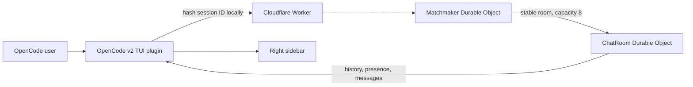
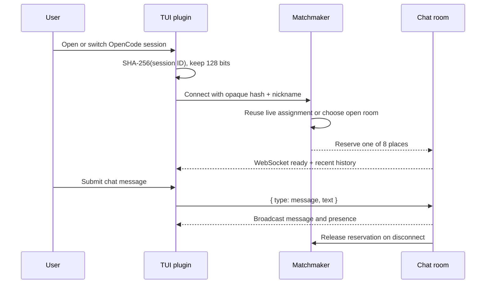

# Session-shuffled OpenCode chat

## System flow





## Problem overview

OpenCode users work alone even when many people are using the tool at the same time. Dax's mockup proposes a small team chat inside OpenCode. Kevin's reply changes a single global room into small, unpredictable groups tied to each OpenCode session.

## Solution overview

Ship an OpenCode v2 TUI package that contributes a chat view to the right sidebar. The plugin hashes the active session ID before connecting to a Cloudflare Worker. A matchmaker gives that hash a stable six-hour room assignment and never reserves more than eight connected places in one room. Chat rooms hold WebSockets, presence, rate limits, and the latest 50 messages in Durable Object storage.

Users choose a local nickname. The service has no accounts and receives no prompts, code, repository paths, or raw OpenCode session IDs.

## Goals

- Show room history, live messages, presence, status, and an inline input in the OpenCode v2 sidebar.
- Keep one active connection per OpenCode session hash and assign no more than eight connected users per room.
- Give a new OpenCode session a separately ranked group while keeping reconnects stable for six hours.
- Run locally with Wrangler and deploy as a Cloudflare Worker.
- Reject malformed nicknames/messages and rate-limit each socket to five messages per ten seconds.

## Non-goals

- Accounts, verified identities, direct messages, avatars, attachments, or code sharing.
- Moderation tools, blocking, reporting, or long-term archives.
- A web client or support for OpenCode v1.
- Guaranteed anonymity against service operators or network observers.

## Important files, docs, and websites

- [`packages/plugin/src/tui.tsx`](../packages/plugin/src/tui.tsx) — registers OpenCode commands, shortcuts, and the sidebar slot.
- [`packages/plugin/src/Chat.ts`](../packages/plugin/src/Chat.ts) — owns the active session WebSocket and chat state.
- [`packages/plugin/src/Panel.tsx`](../packages/plugin/src/Panel.tsx) — renders the terminal chat UI.
- [`packages/worker/src/Matchmaker.ts`](../packages/worker/src/Matchmaker.ts) — owns sticky assignments and room reservations.
- [`packages/worker/src/ChatRoom.ts`](../packages/worker/src/ChatRoom.ts) — owns sockets, presence, rate limits, and room history.
- [`packages/protocol/src/index.ts`](../packages/protocol/src/index.ts) — shared wire contracts and limits.
- [`alchemy.run.ts`](../alchemy.run.ts) — declares the public Worker and both Durable Object namespaces.
- [OpenCode v2 plugin docs](https://v2.opencode.ai/docs/build/plugins) — v2 package and lifecycle contract.
- [OpenCode v2 CLI plugin docs](https://opencode.ai/v2/docs/build/plugins/cli) — current slots, commands, keymaps, storage, and package entrypoints.
- [Cloudflare Durable Objects WebSockets](https://developers.cloudflare.com/durable-objects/best-practices/websockets/) — hibernating socket ownership.
- [Alchemy Cloudflare Worker](https://alchemy.run/providers/cloudflare/worker/) — Worker and Durable Object infrastructure.

## Implementation

### Phase 1: Define the package and wire protocol

```callstack
-OpenCode session
+OpenCode session
+└── sessionHash
+    └── ClientEvent / ServerEvent
```

Create a pnpm workspace with separate plugin, Worker, and protocol packages. Keep public limits and JSON event types in one dependency-free module used on both sides.

```diff:packages/protocol/src/index.ts
+export type ServerEvent =
+  | { type: "ready"; room: string; online: number; history: ChatMessage[] }
+  | { type: "message"; message: ChatMessage }
+  | { type: "presence"; online: number }
+  | { type: "error"; message: string }
```

- [ ] Add root workspace, TypeScript, and package scripts.
- [ ] Define message, presence, ready, and error events in `packages/protocol/src/index.ts`.
- [ ] Validate nickname and message boundaries without adding a schema runtime.
- [ ] Run `pnpm --filter @omeglecode/protocol check`.

### Phase 2: Add capacity-aware Durable Objects

```callstack
-Worker.fetch
+Worker.fetch
+└── Matchmaker.assign
+    └── ChatRoom.fetch
+        ├── acceptWebSocket
+        └── broadcast
```

In production, the Worker sends every connection through one matchmaker object. It reuses an unexpired assignment when possible, ranks open rooms from the session hash, reserves capacity before the upgrade, and releases that place when the socket closes. The room rejects a ninth socket even if reservation state drifts. Local URLs with `development=true` skip matchmaking so developers share one room.

```diff:packages/worker/src/index.ts
+const matched = await matcher.fetch("https://matchmaker/assign", request)
+const assignment = await matched.json<Assignment>()
+return env.ROOMS.get(env.ROOMS.idFromString(assignment.room)).fetch(request)
```

- [ ] Implement `Matchmaker.assign` and `Matchmaker.release` with six-hour sticky records.
- [ ] Implement WebSocket upgrade, nickname collision checks, and eight-user enforcement in `ChatRoom.fetch`.
- [ ] Persist the latest 50 messages and broadcast presence.
- [ ] Route local `development=true` connections to one shared room without changing production assignment.
- [ ] Declare the Worker and both SQLite Durable Object namespaces in `alchemy.run.ts`.
- [ ] Add a Worker integration test that connects nine sessions and checks the room split.
- [ ] Run `pnpm --filter @omeglecode/worker test && pnpm --filter @omeglecode/worker check`.

### Phase 3: Render and control the OpenCode sidebar

```callstack
-OpenCode sidebar
+OpenCode session
+├── session.composer.top slot
+│   └── Connection → sessionHash → WebSocket
+└── sidebar.content slot
+    └── Panel → history and presence
```

Register `/omeglecode`, `/omeglecode-nickname`, and shortcuts through the v2 keymap. A hidden session slot connects as soon as a session opens, even when the sidebar is hidden. The message shortcut opens the sidebar when needed and focuses its inline input.

```diff:packages/plugin/src/tui.tsx
+context.ui.slot({
+  append: "session.composer.top",
+  render: ({ sessionID }) => <Connection sessionID={sessionID} ... />,
+})
+context.ui.slot({
+  append: "sidebar.content",
+  render: () => <Panel ... />,
+})
```

- [ ] Register commands, shortcuts, local nickname storage, and current v2 CLI slots.
- [ ] Connect from `session.composer.top` so a hidden sidebar does not delay room assignment.
- [ ] Render the Dax-style title, online count, message stack, and inline textarea.
- [ ] Hash the raw OpenCode session ID before opening the socket.
- [ ] Document local install, Worker deploy, and endpoint configuration.
- [ ] Run `pnpm --filter opencode-omeglecode build && pnpm check`.
